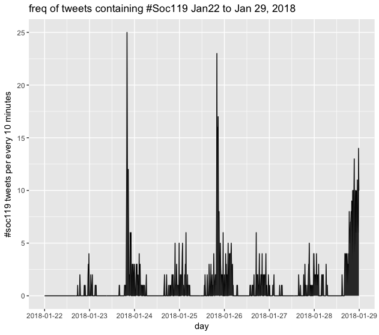
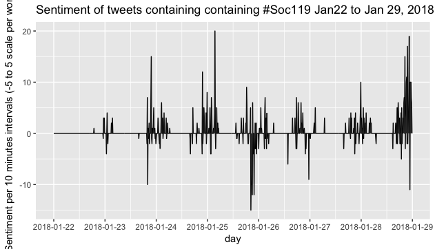
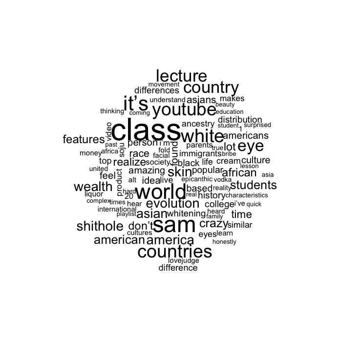

```{r setup, include=FALSE}
knitr::opts_chunk$set(echo = TRUE)
```

Here are some visualizations of Tweets submitted for credit in the class Sociology 119 here at Penn State.  This is only tweets submitted in the week of 01/22/2018 - 01/29/2018.







