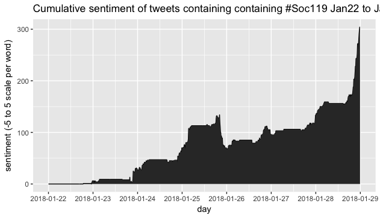

```{r setup, include=FALSE}
knitr::opts_chunk$set(echo = TRUE)
```
I have been using the Twitter API to take tweets submitted for credit in the class Sociology 119 here at Penn State.  Here are some visualizations I've made of these tweets.  I found the tweets by searching twitter for the #soc119 hashtag.


First here is a plot which builds by 1 frame = 1 day, showing tweets submitted in 10 minute intervals throughout the day.
<div align="center">
   <iframe width="560" height="315" src="https://www.youtube.com/embed/KlRBaOJWltg"              frameborder="0" allowfullscreen>
   </iframe>
</div>
Next is a plot showing all tweets submitted from January 22nd to March 4th, subsetted by day of the week (Mon to Sun) and put into 10 minute bins.  I shouldn't be surprised to see that the majority of the tweets are done Sunday night into Monday morning, right around the deadline.


One of the more interesting thing I found on the Tweets' seniment.  It looks like, so far throughout the semester, there were two major events dictating the sentiment, as seen from this plot of cumulative sentiment. One brought it down and another brought it up. In this plot, each word is assigned a sentiment from the "afinn" sentiment dataset.  Stop words (words like and, the, it, etc) are discarded. There is no normalization for an average sentiment based on all tweets, if there was a massive influx of negative tweets, the scale of the drop should account for that. I should also mention that I missed one day, January 29th, which accounts for the flat slope section. This graph is binned in 10 minute intervals.


\bigbreak\bigbreak
The following plots are from tweets only submitted in the week of 01/22/2018 - 01/29/2018.





