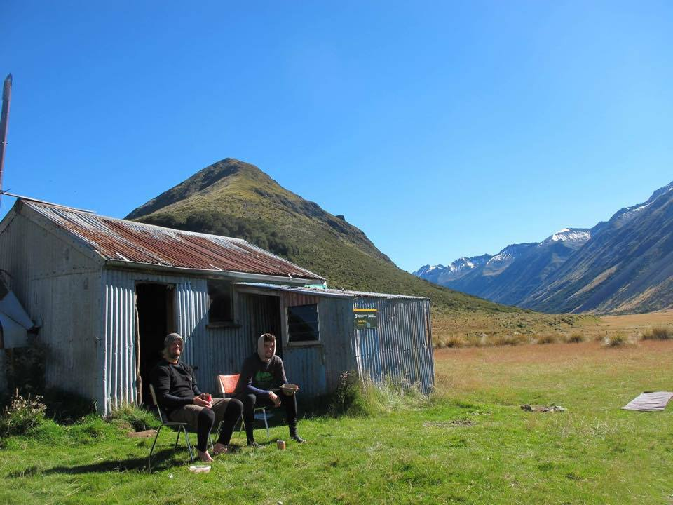

```{r setup, include=FALSE}
knitr::opts_chunk$set(echo = TRUE)
```



Currently (January 2018) I am a physics major and math minor at Penn State University in Pennsylvania USA.  Although I'm pursuing a degree in Physics, I have become very distracted by R these past 6 months.  Distracted isn't the right word though, because I love doing this and I see promise in the skills I'm learning. After earning my degree (in May 2018) I plan to travel to Germany to learn German.

In my free time I'm probably learning something new or starting a new outdoor hobby.  Most recently hobby: caving
