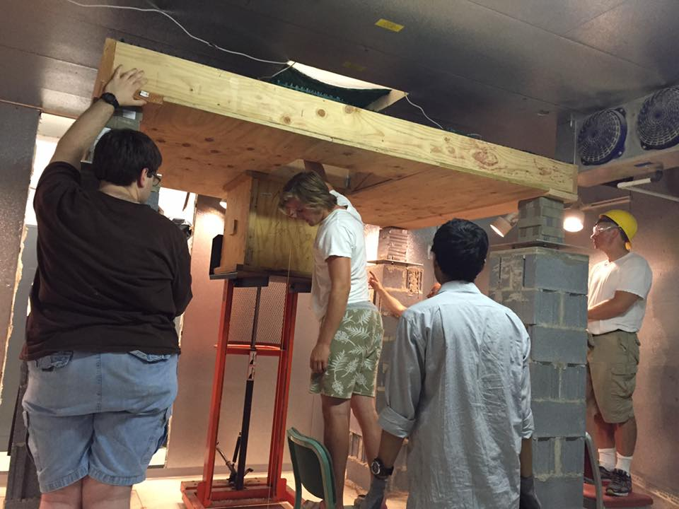
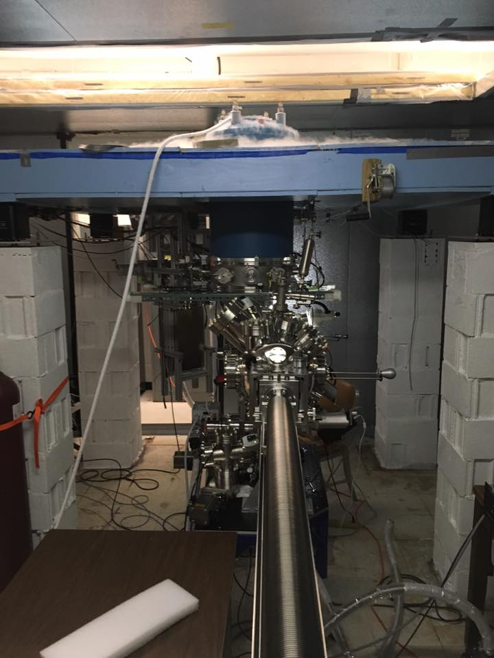

```{r setup, include=FALSE}
knitr::opts_chunk$set(echo = TRUE)
```
  
Welcome to my page.  I'm Conner Shoop.  I like working with large data sets from Kaggle and displaying findings in an easy-to-understand, visual way. I have worked on a few independent projects.  You can view and here on my github page. 

<center>
Building the SNIPE (Scanning Nanoscale Interface Probe Ensemble). Summer 2016, Left to Right:(Bill Dusch, Me, Lavish Pabbi, Ivan Skachko) 

</center>
<center>
Finished SNIPE
\newline 

</center>
